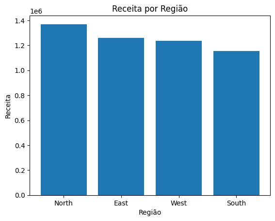
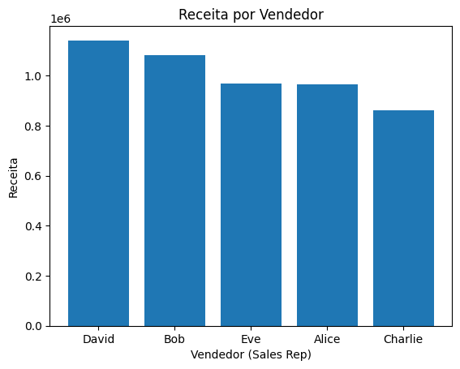
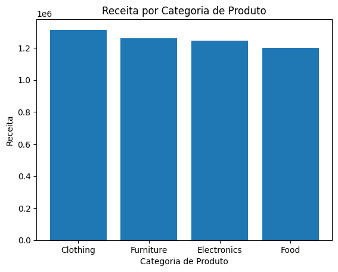
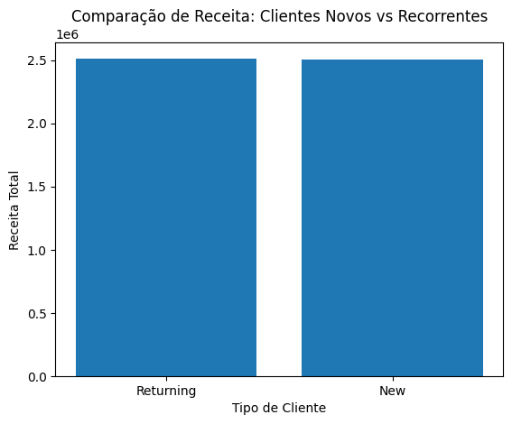
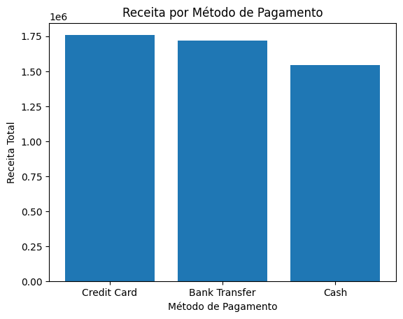
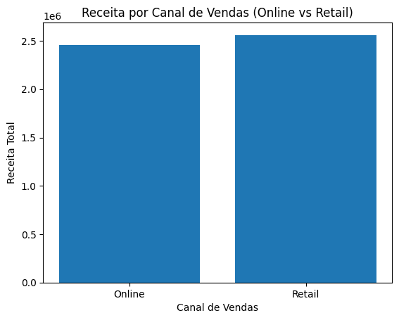

# 📊 Insights

## Receita Total

A empresa gerou um faturamento total de R$ 5,02 milhões no período analisado, indicando forte volume de vendas. Esse valor serve como base para análises de crescimento, lucratividade e performance por região e canal de vendas.

## Receita por Região

A análise de receita por região mostrou que a região North possui o maior faturamento, seguida por East e West com desempenho semelhante. A região South apresentou menor receita, indicando oportunidade de crescimento. A distribuição equilibrada entre regiões sugere boa diversificação geográfica das vendas.

## Receita por Vendedor (Sales Rep)

A análise de receita por vendedor mostrou que David é o principal gerador de receita, seguido por Bob. Eve e Alice apresentaram desempenho semelhante, enquanto Charlie registrou o menor faturamento, indicando oportunidades de melhoria. A distribuição relativamente equilibrada sugere boa contribuição geral da equipe de vendas.

## Vendas por Categoria de Produto

A análise da receita e quantidade vendida por categoria mostra diferenças relevantes no desempenho dos produtos e no comportamento de consumo dos clientes.

* **Clothing** lidera em faturamento (**R$ 1,31 milhão**) e volume de vendas (6.922 unidades), indicando alta demanda e forte contribuição para a receita total.
* **Furniture** apresenta a segunda maior receita (**R$ 1,26 milhão**) e alto volume de vendas (6.729 unidades), sugerindo boa aceitação no mercado e possível ticket médio elevado.
* **Electronics** gera receita elevada (**R$ 1,24 milhão**) com menor quantidade vendida (6.096 unidades), indicando produtos de maior valor unitário.
* **Food** possui a menor receita total (**R$ 1,20 milhão**), apesar do bom volume de vendas (5.608 unidades), sugerindo produtos de menor ticket médio e alta rotatividade.

## Clientes Novos vs Recorrentes

A análise da receita entre clientes novos e recorrentes mostra um equilíbrio significativo no faturamento gerado por ambos os grupos.

1. Receita praticamente equilibrada entre os grupos:
* Clientes recorrentes: R$ 2,51 milhões
* Clientes novos: R$ 2,50 milhões
2. Leve vantagem dos clientes recorrentes, mesmo com menor quantidade:
* Recorrentes: 496 clientes
* Novos: 504 clientes

Indica que clientes recorrentes possuem maior valor médio por compra.
Boa capacidade de aquisição de novos clientes, já que o número de novos clientes é maior.
Fidelização eficiente, pois clientes recorrentes continuam gerando receita relevante.

## Receita por Método de Pagamento

A análise da receita por método de pagamento revela diferenças no comportamento de compra dos clientes e nas preferências de pagamento.

* **Credit Card** é o principal método de pagamento, gerando R$ 1,76 milhão em receita, indicando maior preferência dos clientes por pagamentos rápidos e parceláveis.
* **Bank Transfer** apresenta desempenho muito próximo (R$ 1,72 milhão), demonstrando forte adesão a pagamentos digitais e possivelmente maior uso em compras de maior valor.
* **Cash** possui a menor receita (R$ 1,54 milhão), sugerindo menor utilização em comparação aos métodos eletrônicos.

## Vendas por Canal (Online vs Retail)

A análise da receita por canal de vendas mostra um desempenho equilibrado entre os canais físico e digital, com leve vantagem para o varejo tradicional.
* **Retail** apresenta a maior receita (R$ 2,56 milhões) e maior volume de vendas (512 transações), indicando forte desempenho do canal físico.
* **Online** gerou R$ 2,46 milhões com 488 vendas, demonstrando alta relevância do canal digital e forte participação no faturamento total.

A diferença de receita entre os canais é pequena, sugerindo um modelo de vendas bem distribuído entre os ambientes físico e online.
O canal Retail possui maior volume de vendas, enquanto o canal Online apresenta desempenho muito competitivo mesmo com menos transações.
